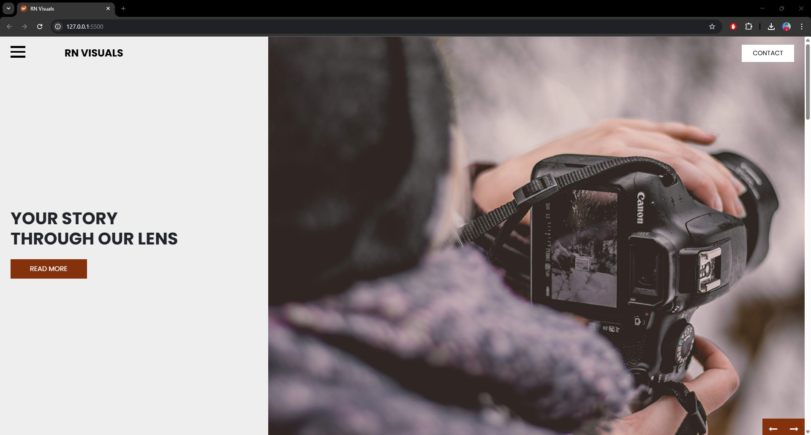

# RN Visuals

RN Visuals is a modern, responsive photography and creative portfolio website. It is designed to showcase a creative team, portfolio gallery, and contact information for photographers, visual artists, or studios who want to present their work professionally online.

## Features

- Responsive design using Bootstrap
- Team showcase section
- Portfolio gallery with image previews
- Contact section with email integration
- Social media links
- Google Maps integration

## Demo



## Getting Started

1. **Clone the repository:**
   ```
   git clone https://github.com/yourusername/rn-visuals.git
   ```
2. **Navigate to the project directory:**
   ```
   cd rn-visuals
   ```
3. **Open `index.html` in your browser to view the site.**

## Folder Structure

- `index.html` - Home page
- `about.html` - About page
- `portfolio.html` - Portfolio gallery
- `team.html` - Team showcase
- `css/` - Stylesheets (Bootstrap, Font Awesome, custom styles)
- `images/` - Image assets
- `js/` - JavaScript files

## License

This project is licensed for viewing and reference only.  
**All rights reserved.**  
You may not copy, use, modify, or distribute any part of this project without explicit written permission from

---

**Designed by [Aryan Rauniyar](https://aryanrauniyar.com.np/)**
